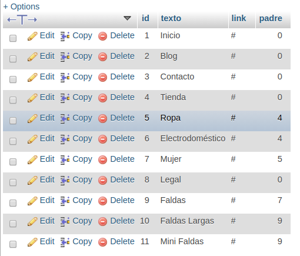

# 1. PHP

## 1.1. Variables variables

Con con siguiente código podemos generar una variable por cada elemento recibido por post

```php
foreach($_POST as $key => $value){
    $$key = $value
}

echo $nombre; //nos mostrara el valor de $_POST['nombre]
echo $apellido;

```

## 1.2. Retrollamas o callback

Utilizamos las retrollamadas para ejecutar una función dentro de si misma hasta que se deje de cumplir una condición.

### 1.2.1. Caso Práctico

Supongamos que queremos construir un menu de categorias y subcategorias que pueden tener subcategorias de forma ilimitada.
Queremos construir este menu dinámicamente, sin importar las categorías que tengamos. Para ello tenemos que recorrer la base de datos preguntando por el id_padre = 0 (categoría principal) para pintar el primer menu, después pintaremos los submenus cuando el id_padre sea igual al id y volveremos a llamar a la función hasta que no sea así.

Recibimos los las categorías desde una base de datos con la siguiente información:

> id - text - link - padre
> 

#### 1.2.1.1. Incluimos nuestro fichero de conexión para la base de datos.

```php
<?php
include_once '../../../servidores/includes/datos.php';
```

#### 1.2.1.2. Consultas a la base de datos y generación de una array númerico con los datos.

```php
$query = "select * FROM menu where padre = 0 order by id";
$resultado = $mysqli->query($query);
$array = $resultado->fetch_all();
```

- 2.1. Guardamos en la variable `$query` la consulta a la base de datos, para preguntar cuales son las categorias padres, las que tienen id= 0.
- 2.2. Guardamos en `$resultado` el [**objeto mysql_result**](https://www.php.net/manual/es/class.mysqli-result.php) resultante de de ejecutar el **método** [`->query`](https://www.php.net/manual/es/mysqli.query.php#refsect1-mysqli.query-returnvalues) del **objeto** `$myslqi` de la clase `mysqli` pasandole como parametros los valores de nuestra query `$query`.
- 2.3. Guardamos en la variable `$array` una array númerico que obtenemos al ejecutar el **método** [`fetch_all()`](https://www.php.net/manual/es/mysqli-result.fetch-all.php) de esta manera podremos recorrerlo más tarde utilizando sus keys [0],[1], etc...

```php
Array
(
    [0] => Array
        (
            [0] => 1
            [1] => Inicio
            [2] => #
            [3] => 0
        )

    [1] => Array
        (
            [0] => 2
            [1] => Blog
            [2] => #
            [3] => 0
        )

    [2] => Array
        (
            [0] => 3
            [1] => Contacto
            [2] => #
            [3] => 0
        )

    [3] => Array
        (
            [0] => 4
            [1] => Tienda
            [2] => #
            [3] => 0
        )

    [4] => Array
        (
            [0] => 8
            [1] => Legal
            [2] => #
            [3] => 0
        )

)
```

#### 1.2.1.3. Creamos la función

```php
function crearjson($array, $mysqli){
    echo "<ul>";
    foreach ($array as $key => $value) {
        echo "<li>" . $value[0] . " " . $value[1];
        $query = "select * FROM menu where padre = " . $value[0] . " order by id";
        $resultado = $mysqli->query($query);
        if($resultado->num_rows > 0){
            $resultado = $resultado->fetch_all();
            crearjson($resultado,$mysqli);
        }
        echo '</li>';
    }
    echo "</ul>";
}
```

- 3.1. Creamos la función **crearjson** pasándole la _array_ `$array` y el _objeto_ `$mysqli`.
- 3.1. Recorremos la array e imprimimos el `$value[0]` (el id) y el `$value[1]` (columna texto de la base de datos que nos imprime el nombre de la categoria.).
- 3.1.1. Cremamos una nueva consulta, para obtener las categorías que el **id_padre** sea igual al `value[0]`, en el caso de la 4 vuelta, `value[0]` será igual a `4`, y la consulta nos devolverá las subcategorias que su **id_padre** sea igual a `4`.
- 3.1.2. Volvemos a crear el **objeto** `$resultado` al ejecutar el método `->query` del **objeto** `$mysqli`.
- 3.1.3. Preguntamos el número de filas del **objeto** `$resultado` (que es te tipo mysql_result, el número de filas que nos devuelve accediendo a el con [`$mysqli->num_rows`](https://www.php.net/manual/es/mysqli-result.num-rows.php))

> En caso de que nos devuelva mayor de 0, significa que ha encontrado una subcategoria.

- 3.2. Volvemos a realizar el paso 2.3 para crear la array.
- 3.3. Hacemos una `retrollamada` a la función pero esta vez pasándole la **array** `$resultado` y el \*\*objeto `$mysqli`.
- 3.4. Por último cerramos las etiquetas de las listas.

### 1.2.2. Código completo

```php
<?php
include_once '../../../datos.php';

function crearjson($array, $mysqli){
    echo "<ul>";
    foreach ($array as $key => $value) {
        echo "<li>" . $value[0] . " " . $value[1];
        $query = "select * FROM menu where padre = " . $value[0] . " order by id";
        $resultado = $mysqli->query($query);
        if($resultado->num_rows > 0){
            $resultado = $resultado->fetch_all();
            crearjson($resultado,$mysqli);
        }
        echo '</li>';
    }
    echo "</ul>";
}

//Preparamos la consulta
$query = "select * FROM menu where padre = 0 order by id";
//Creamos el objeto con los valores de la consulta
$resultado = $mysqli->query($query);
echo gettype($resultado); //objeto
//creamos una array accediendo al objeto, utilizando un método
$array = $resultado->fetch_all();
echo gettype($array); //array
//Comprobamos los datos de la array
echo "<pre>";
    print_r($array);
echo "</pre>";
//Ejecutamos la función
crearjson($array,$mysqli);

```
