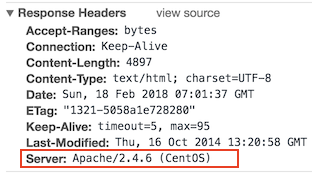
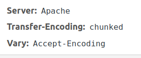

# Seguridad Web

Esta pagina pretende recabar la información necesaria para proteger nuestro servidor web.


## Esconder la versión del servidor web (Apache)

Para impedir que pueda obtener la versión de nuestro servidor apache debemos añadir en nuestro fichero de configuración `/etc/apache2/apache2.conf



```bash
ServerTokens Prod
ServerSignature Off
```

Reiniciamos apache

```
systemctl restart apache2.conf
```



Puedes lanzar esta linea con permisos de root para añadir directamente las dos lineas al final del archivo:

```
echo -e "\n ServerTokens Prod \nServerSignature Off \n" >> /etc/apache2/apache2.conf
```


Mas información [aquí](https://httpd.apache.org/docs/2.4/es/mod/core.html#serversignature)


## Cambiar el puerto por defecto de SSH

# Enlaces

WAF(Web application Firewall)
- https://sucuri.net/website-firewall/
